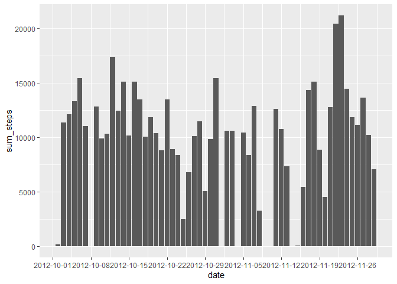
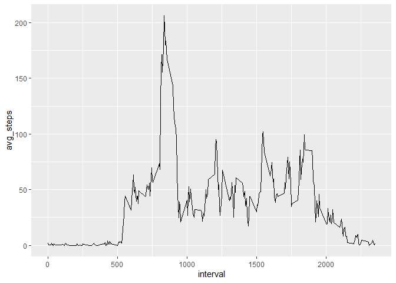
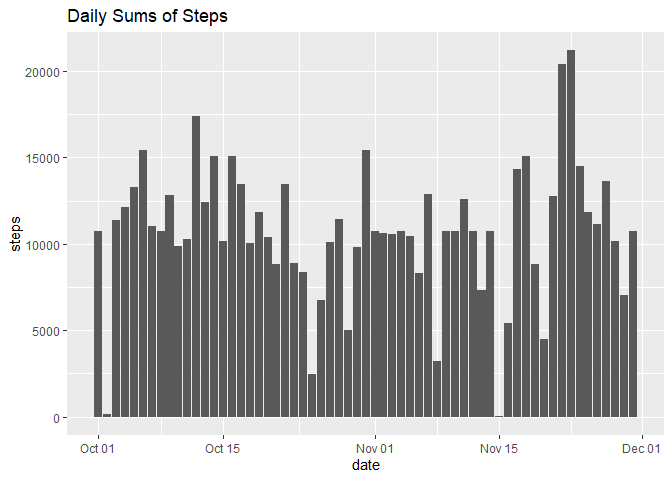
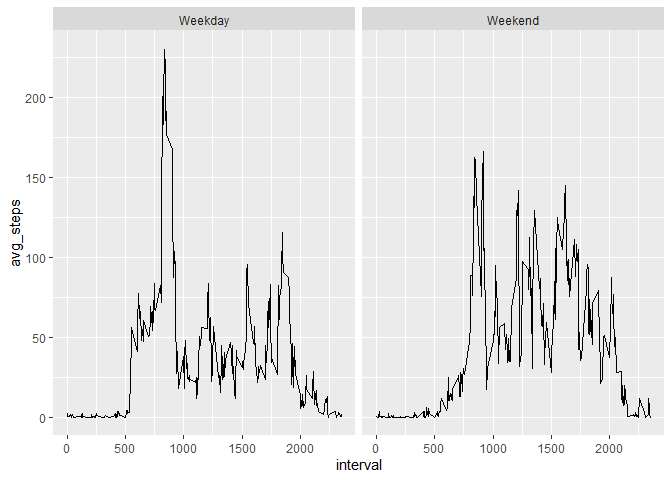

### Loading and preprocessing the data

Here I have:

    - Read in the data
    
    - Counted the number of missing values with the complete.cases function
    
    - Changed the date variable to a date format


```r
activity<-read.csv('activity/activity.csv')
activity$date<-ymd(activity$date)
```
### First Histogram: Total Number of Steps per Day


```r
activity %>%
    group_by(date) %>%
    summarize(sum_steps=sum(steps)) %>%
    ggplot(aes(x=date,y=sum_steps)) + 
    geom_bar(stat='identity') + 
    scale_x_date(breaks=date_breaks('weeks'))
```

```
## Warning: Removed 8 rows containing missing values (position_stack).
```

<!-- -->
### Daily Means and Medians with Original Data


```r
activity %>%
    group_by(date) %>%
    summarize(mean_steps=mean(steps,na.rm=T),median_steps=median(steps,na.rm=T))
```

```
## # A tibble: 61 x 3
##    date       mean_steps median_steps
##    <date>          <dbl>        <dbl>
##  1 2012-10-01    NaN               NA
##  2 2012-10-02      0.438            0
##  3 2012-10-03     39.4              0
##  4 2012-10-04     42.1              0
##  5 2012-10-05     46.2              0
##  6 2012-10-06     53.5              0
##  7 2012-10-07     38.2              0
##  8 2012-10-08    NaN               NA
##  9 2012-10-09     44.5              0
## 10 2012-10-10     34.4              0
## # ... with 51 more rows
```
### Time Series Plot of Average Steps over Intervals


```r
activity %>%
    group_by(interval) %>%
    summarize(avg_steps=mean(steps,na.rm=T)) %>%
    ggplot(aes(x=interval)) +
    geom_line(aes(y=avg_steps))
```

<!-- -->

```r
max.values<-activity %>%
    group_by(interval) %>%
    summarize(max_steps=max(steps,na.rm=T))
max.set<-max.values[which(max.values$max_steps==max(max.values$max_steps)),]
print(paste0('The interval with the highest average of daily steps is ',max.set$interval,' with an average of ',
             max.set$max_steps,' steps'))
```

```
## [1] "The interval with the highest average of daily steps is 615 with an average of 806 steps"
```

### Addressing Missing Values


```r
x<-complete.cases(activity)
NA.count<-length(activity[,1])-sum(x)
print(paste0('Number of NAs in dataset = ',NA.count))
```

```
## [1] "Number of NAs in dataset = 2304"
```

Here I have:

    - Created a new dataset called NAs.replaced
    
    - In the new dataset, I replaced the missing values in the step variable 
        with the mean of that interval's steps across all day
    

```r
replace<-activity %>%
    group_by(interval) %>%
    mutate(mean_steps=mean(steps,na.rm=T))
NAs.replaced<-activity
for(i in 1:length(NAs.replaced$steps)){
    if(is.na(NAs.replaced$steps[i])){
        NAs.replaced$steps[i]<-replace$mean_steps[i]
    }
}
```

First 3 lines of activity dataset:


```r
activity[1:3,]
```

```
##   steps       date interval
## 1    NA 2012-10-01        0
## 2    NA 2012-10-01        5
## 3    NA 2012-10-01       10
```

First 3 lines of activity dataset:


```r
NAs.replaced[1:3,]
```

```
##       steps       date interval
## 1 1.7169811 2012-10-01        0
## 2 0.3396226 2012-10-01        5
## 3 0.1320755 2012-10-01       10
```
### Second Histogram: Total Number of Steps per Day with NAs Removed


```r
NAs.replaced %>%
    group_by(date) %>%
    ggplot(aes(date,steps))+
    stat_summary(fun=sum,geom='bar')+
    ggtitle('Daily Sums of Steps')
```

<!-- -->

### Daily Means and Medians with NAs Removed

The main difference is that there are no NaN values.


```r
NAs.replaced %>%
    group_by(date) %>%
    summarize(mean_steps=mean(steps,na.rm=T),median_steps=median(steps,na.rm=T))
```

```
## # A tibble: 61 x 3
##    date       mean_steps median_steps
##    <date>          <dbl>        <dbl>
##  1 2012-10-01     37.4           34.1
##  2 2012-10-02      0.438          0  
##  3 2012-10-03     39.4            0  
##  4 2012-10-04     42.1            0  
##  5 2012-10-05     46.2            0  
##  6 2012-10-06     53.5            0  
##  7 2012-10-07     38.2            0  
##  8 2012-10-08     37.4           34.1
##  9 2012-10-09     44.5            0  
## 10 2012-10-10     34.4            0  
## # ... with 51 more rows
```

Adding 2 new variables to the dataset with the NAs removed

    DayofWeek (Day of the Week) and TimeofWeek (Weekday or Weekend)


```r
NAs.replaced<-NAs.replaced %>%
    mutate(DayofWeek=wday(date,label=T)) %>%
    mutate(TimeofWeek=ifelse(DayofWeek%in%c('Sat','Sun'),'Weekend','Weekday'))
NAs.replaced$TimeofWeek<-as.factor(NAs.replaced$TimeofWeek)
```
### Time Series Plot Split by Time of Week

Splitting the plot by the factor of TimeofWeek


```r
NAs.replaced %>%
    group_by(TimeofWeek,interval) %>%
    summarize(avg_steps=mean(steps,na.rm=T)) %>%
    ggplot(aes(x=interval)) +
    geom_line(aes(y=avg_steps)) + 
    facet_wrap(~TimeofWeek)
```

<!-- -->


